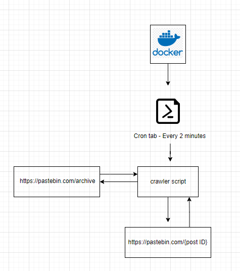

#### **web crawler**

simple web crawler to site: https://pastebin.com/ and should store the most recent "pastes" in a structured data model

The crawler based a scheduler in Docker Container using Cronjob file which runs every 2 minutes

#### clone  
`https://github.com/6645022/web-crawler.git`

#### run 
`docker-compose up`

